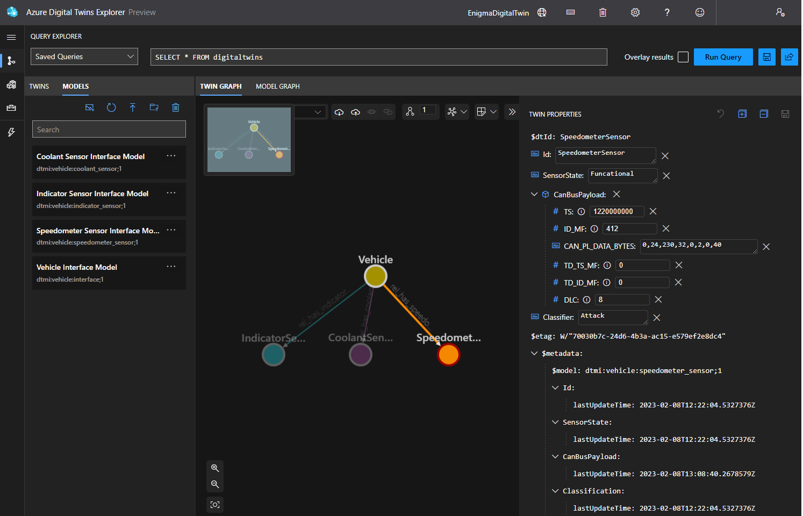
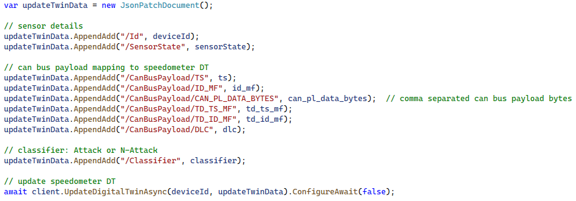

# ENIGMA: An Explainable Digital Twin Security Solution for Cyber-Physical Systems
To address the explainable security challenges of digital twins (DTs), this research work proposes a gamification approach called sEcuriNg dIgital twins through GaMification Approach (ENIGMA). While leveraging DTs as an offensive security platform, ENIGMA provides gaming scenarios to assess DTs security and train security analysts.

Along with the ENIGMA framework, we also present a prototypical proof of concept to demonstrate and validate the ENIGMA. We selected the in-vehicle network traffic data use case. In order to build the twin environemnt for our use case, we registered three IoT devices (Speedometer sensor, indicator sensor, and coolant sensor) on Azure IoT Hub and utilize Microsoft Azure Digital Twins platform to construct vehicle DT.

# Models
Microsoft Azure Digital Twins provides a cloud platform and enables the ability to define vocabulary for building twin graph. This capability is provided through user-provided [models](https://learn.microsoft.com/en-us/azure/digital-twins/concepts-models). Azure Digital Twins models are represented in the JSON-LD-based [Digital Twin Definition Language (DTDL)](https://marketplace.visualstudio.com/items?itemName=vsciot-vscode.vscode-dtdl). We created four models for vehicle DT, one related to the vehicle interface (VehicleInterface.json), second belongs to the speedometer sensor (SpeedometerSensor.json), third define the indicator sensor (IndicatorSensor.json), and fourth is related to the coolant sensor (CoolantSensor.json).

# Microsoft Azure Digital Twins explorer
Azure Digital Twins explorer is a visual tool for exploring the data in Azure Digital Twins graph. As well as, to view, query, and edit models, twins, and relationships. 

[Azure Digital Twins Explorer](https://learn.microsoft.com/en-us/azure/digital-twins/concepts-azure-digital-twins-explorer)

[Setup Azure Digital Twins Explorer Locally](https://learn.microsoft.com/en-us/samples/azure-samples/digital-twins-explorer/digital-twins-explorer)

We use this tool as it provides a graphical interface for examining and traversing the structure and data of Azure DTs models. We examine and interact with vehicle DT models, including their attributes, relationships, telemetry data, and more, using ADT explorer. In the ADT explorer, we connect with the vehicle DT using the Azure DTs instance URL. Furthermore, the ADT explorer includes query capabilities, which allow us to search for entities based on specific criteria such as entity type or property values. The query function can be used to filter and display individual entities in a model, as well as to understand the relationships between entities. The query's results are displayed in the graph, tabular, or JSON format. Overall, the ADT explorer helps us to construct, manage, and display vehicle DT models.

# JSON Patch Document for DTs readable format
To convert data into DTs readable format, we use JSON Patch Document. It allows us to make partial updates to an existing data ingestion JSON document without having to completely replace it, such as changing a single field, by providing the changes in the form of JSON operations. The operations specify the modifications to be made, for instance, adding, removing, or replacing fields, and they are applied to the target document in a precise order (e.g., updateTwinData.AppendAdd operation in our case). It also minimizes the amount of data carried over the network and avoids potential disputes that could come from updating the same document simultaneously.

