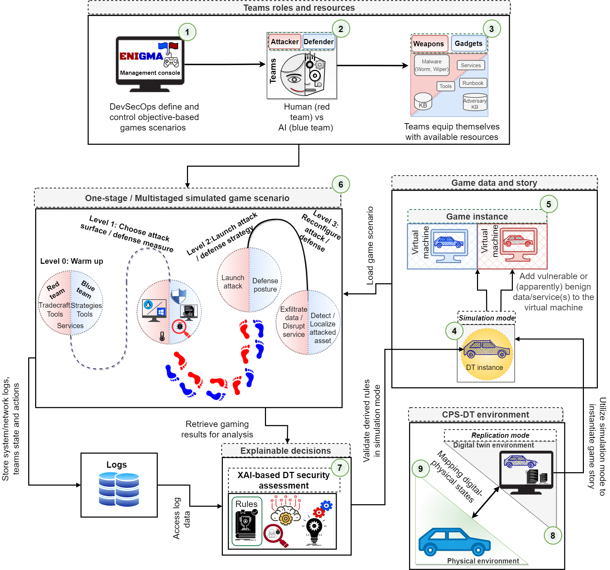
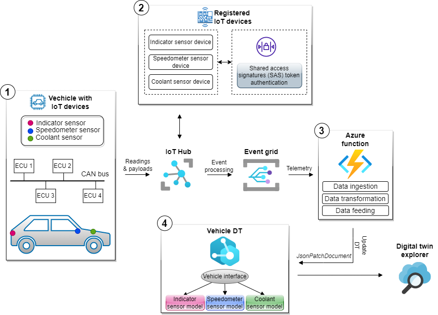

# ENIGMA: An Explainable Digital Twin Security Solution for Cyber-Physical Systems
To address the explainable security challenges of digital twins (DTs), this research work proposes a gamification approach called sEcuriNg dIgital twins through GaMification Approach (ENIGMA). While leveraging DTs as an offensive security platform, ENIGMA provides gaming scenarios to assess DTs security and train security analysts.

Along with the ENIGMA framework, we also present a prototypical proof of concept to demonstrate and validate the ENIGMA. We selected the in-vehicle network traffic data use case. In order to build the twin environemnt for our use case, we registered three IoT devices (Speedometer sensor, indicator sensor, and coolant sensor) on Azure IoT Hub and utilize Microsoft Azure Digital Twins platform to construct vehicle DT.

# Models
Microsoft Azure Digital Twins provides a cloud platform and enables the ability to define vocabulary for building twin graph. This capability is provided through user-provided [models](https://learn.microsoft.com/en-us/azure/digital-twins/concepts-models). Azure Digital Twins models are represented in the JSON-LD-based [Digital Twin Definition Language (DTDL)](https://marketplace.visualstudio.com/items?itemName=vsciot-vscode.vscode-dtdl). We created four models for vehicle DT, one related to the vehicle interface (VehicleInterface.json), second belongs to the speedometer sensor (SpeedometerSensor.json), third define the indicator sensor (IndicatorSensor.json), and fourth is related to the coolant sensor (CoolantSensor.json).

# Microsoft Azure Digital Twins explorer
Azure Digital Twins explorer is a visual tool for exploring the data in Azure Digital Twins graph. As well as, to view, query, and edit models, twins, and relationships. 

[Azure Digital Twins Explorer](https://learn.microsoft.com/en-us/azure/digital-twins/concepts-azure-digital-twins-explorer)

[Setup Azure Digital Twins Explorer Locally](https://learn.microsoft.com/en-us/samples/azure-samples/digital-twins-explorer/digital-twins-explorer)
